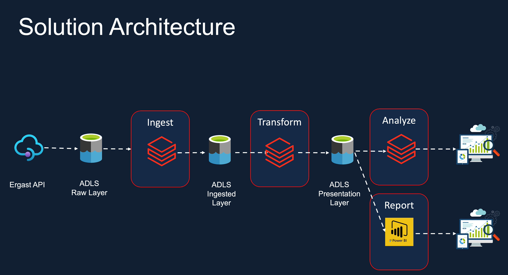

# Formula 1 Data Analytics Project

This project aims to perform data analytics on Formula 1 racing data using the Ergast API as the data source. The architecture of the project is as follows:

## Architecture Overview

1. **Ergast API:** The Ergast API serves as the primary data source for Formula 1 racing data.

2. **ADLS RAW layer:** The data from the Ergast API is ingested into the Azure Data Lake Storage (ADLS) RAW layer, which acts as the initial storage layer for the raw data.

3. **Ingest (Databricks Spark):** Using Databricks Spark, the data is ingested from the ADLS RAW layer, performing necessary data transformations and cleaning operations.

4. **ADLS ingest layer:** The transformed data is stored in the ADLS ingest layer, serving as an intermediate storage layer for further processing.

5. **Transform (Databricks Spark):** Databricks Spark is used again to perform additional data transformations and aggregations on the data stored in the ADLS ingest layer.

6. **ADLS presentation layer:** The transformed and processed data is stored in the ADLS presentation layer, providing a structured and optimized format for analysis.

7. **Analyse (Databricks):** Leveraging the power of Databricks, the data in the ADLS presentation layer is analyzed using various analytical techniques and algorithms.

8. **ADLS presentation layer to Power BI:** The analyzed data from the ADLS presentation layer is visualized and presented using Power BI for intuitive and interactive data exploration.

